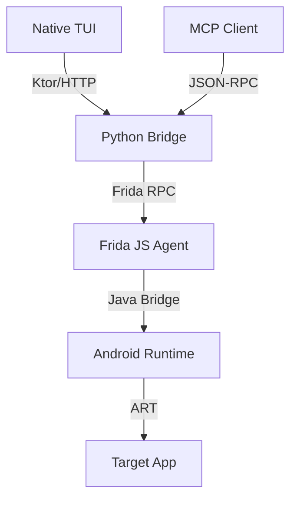

# Barbatos

<p align="center">
  
  
  
  
</p>

<p align="center">
  <b>Android Runtime Debugger & MCP Server.</b><br>
  <i>"Understanding the language of systems, revealing hidden states, and reconciling the gap between developer and machine."</i>
</p>

<div align="center">
  <p>IMAGEM_AQUI_1</p>
</div>

## Why the name "Barbatos?"

The name is inspired by the mythological Barbatos, but in the context of Android debugging.

>Barbatos is a spirit ([wikipedia](https://en.wikipedia.org/wiki/Barbatos)) that grants the ability to understand the spoken language of animals. He reveals hidden treasures that have been concealed by the enchantment of magicians, gives knowledge of past and future events, and reconciles disputes between friends and those who hold power.

This project aims to grant the hability to understand deeply about an App, reveal hidden states in the heap, gives knowledge about changes of state (*only past and present tho*), and reconcile the gap between developers and machines (apps) by providing a more intuitive way to interact with them.

## What is this project?
here you will find 3 things: A TUI debugger ("barbatos"), a MCP server ("barbatos-mcp") and a core Http API ("barbatos-bridge") that its used by the TUI and MCP server.

**The focus of this project is to bring Frida powerfullness closer to devs and vibe-coders without the need to know how Frida is setup and how it works.**

## Why use Barbatos?

#### "Why use Barbatos if you can use Frida directly?" 
Frida has a trade-off, in one end you got a very powerful tool, and in the other you have to understand how to setup (if you dont got a rooted device), and interact with its API. For some people this isnt a problem at all, but it does have a learning curve.

#### "And what about Objection?"
Ok thats a pretty good question, objection its an abstraction of frida just like barbatos, and it got a lot more capabilities, battle tested... For most cases objection is enough. But objection inherited the Frida overhead, he assumes you already has frida setup... which sometimes its enough to not use it at all. Also, objection is more focused on pentesting and red teaming.

unlike objection, barbatos was developed based on the assumption that the user know nothing about Frida to use, the only requirement is the app being debuggable, nothing more. Barbatos was designed with the mindset of being a debugging tool, so its more focused on that experience.

#### "Nowadays you can use a frida-mcp to handle the complexity"
Yes, all frida-mcp's (there are a few of them at this time) handles very smoothly actually, the only downside is that it also inherited the overhead of the user needing to know how to setup Frida, which again, can be a problem for some, but not for all.

Barbatos is a TUI debugger designed to be frictionless, 0 setup needed. It handle all the overhead needed to use Frida in your app. Apart from that, it has the same purpose of provide Frida's power in a more user-friendly way.

---

## Main Use Cases

*   **Terminal-First Experience:** ready to use in any terminal environment (local, SSH, WSL) without IDE plugins or complex setup.
*   **Simple App Exploration:** quickly list classes, inspect objects, and understand app structure.
*   **Real-time App Debugging:** modify field values on the fly and hook methods to see live execution flow.
*   **AI-Assisted Debugging:** Use the built-in MCP Server to let LLMs (Claude/Gemini/Cursor) debug your app autonomously.
* (soon) **Intercept Method Calls:** Modify return values or arguments of any method.

---

## Main Features

*   **Class Discovery:** Real-time enumeration of loaded Java/Kotlin classes with package filtering.
*   **Deep Inspection:** Recursive traversal of object hierarchies (Fields, Maps, Collections, Arrays).
*   **Zero-effort Integration:** No IDE plugins or dependency installs — just run the binary and connect.
*   **Method Hooking:** Intercept execution flow, inspect arguments, and capture return values.
*   **Live Field Editing:** Modify primitive field values (String, Int, Boolean) in real-time to test hypotheses.
*   **MCP Server:** Native Model Context Protocol support to connect your debugger to AI agents.

---

## AI-Driven Debugging (MCP Server)

Barbatos provides native support for the Model Context Protocol (MCP). By connecting an AI agent to the Barbatos MCP Server, your LLM becomes an autonomous debugging assistant capable of direct runtime interaction. 

### Example Agent Capabilities (experimental):

*   **State Exploration:** "Locate the active `LoginState` instance and tell me the value of its `errorCode` field."
*   **DI Troubleshooting:** "Search for `MyUseCase` instance in `MyViewModel` and see if it is the same one in `MyOtherViewModel`."
*   **Method Hooking:** "Tell me the parameters passed to the `MyViewModel.fetchData` method every time it is called."
*   **Live Edit:** "Change the `isPremium` boolean on the active `UserProfile` instance to `true`."
*   **Root Cause Analysis:** "List all instances of `ApiError`, check their `message` field, and identify recurring failure patterns."
* (soon) **Mock Behavior:** "Intercept the `fetchData` method in `MyViewModel` and modify its return to throw an exception when the `isActive` field is `false`."


---

## Architecture

Barbatos uses a multi-stage pipeline for reliable communication:



1.  **Native TUI**: Standalone Kotlin Native binary for a deterministic terminal experience.
2.  **MCP Client**: Integration with AI agents (Claude, Cursor) via Model Context Protocol.
3.  **Python Bridge**: Mediator exposing a standardized JSON-RPC interface.
4.  **Frida Injection**: JS agent injected into the process for runtime interaction.

---

## Available MCP Tools

<details>
<summary><b>View All 8 Debugging Tools</b></summary>

| Tool | Description |
| :--- | :--- |
| `barbatos_list_classes` | Retrieves loaded Java classes with optional search and package filtering. |
| `barbatos_inspect_class` | Returns all static/instance fields and methods of a specific class. |
| `barbatos_count_instances` | Counts live instances of a class on the heap. |
| `barbatos_list_instances` | Returns handles/IDs of live instances for a given class. |
| `barbatos_inspect_instance` | Recursively explores an instance's fields and values. |
| `barbatos_set_field_value` | Modifies a primitive field (String, Int, Boolean, etc.) in real-time. |
| `barbatos_hook_method` | Intercepts method calls and logs arguments/returns. |
| `barbatos_get_hook_events` | Retrieves the latest method interception events collected by the agent. |

</details>

---

## Installation

### **Quick Install (Recommended)**
Run the following command to automatically detect architecture and setup environment:

```bash
curl -sSL https://barbatos.victorlpgazolli.dev/install.sh | bash
```

### **APT Repository (Debian/Ubuntu/WSL)**
For Debian-based systems, you can use our APT repository to keep the tools up to date.

1.  **Add the GPG key:**
    ```bash
    curl -s https://victorlpgazolli.github.io/barbatos/barbatos-repo.gpg | sudo apt-key add -
    ```

2.  **Add the repository:**
    ```bash
    echo "deb [arch=arm64] https://victorlpgazolli.github.io/barbatos/ stable main" | sudo tee /etc/apt/sources.list.d/barbatos.list
    ```

3.  **Install the components:**
    ```bash
    sudo apt update
    sudo apt install barbatos barbatos-bridge barbatos-mcp
    ```

### **MCP Server Setup**
To use `barbatos` with **Claude Desktop**, add this to your `claude_desktop_config.json`:

```json
{
  "mcpServers": {
    "barbatos-debugger": {
      "command": "python3",
      "args": ["/path/to/barbatos/mcp_server/server.py"]
    }
  }
}
```

*Note: Ensure the barbatos-bridge is running (listening on port 8080) before using the MCP tools.*