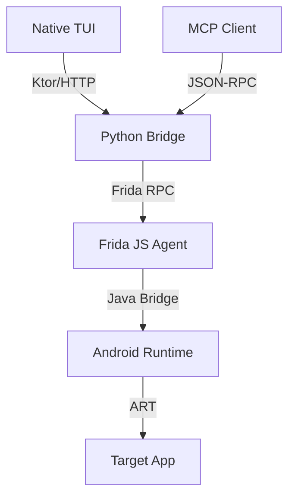

# barbatos: Interactive Debug Kit

<p align="center">
  
  
  
  
</p>

<p align="center">
  <b>Android Runtime Debugger & MCP Server.</b><br>
  <i>Unified terminal interface for low-level instrumentation and AI-assisted state manipulation.</i>
</p>

---

## Main Use Cases

*   **Terminal-First Experience:** ready to use in any terminal environment (local, SSH, WSL) without IDE plugins or complex setup.
*   **Simple App Exploration:** quickly list classes, inspect objects, and understand app structure.
*   **Real-time App Debugging:** modify field values on the fly and hook methods to see live execution flow.
*   **AI-Assisted Debugging:** Use the built-in MCP Server to let LLMs (Claude/Gemini/etc...) debug your app.

---

## Main Features

*   **Class Discovery:** Real-time enumeration of loaded Java/Kotlin classes with package filtering.
*   **Deep Inspection:** Recursive traversal of object hierarchies (Fields, Maps, Collections, Arrays).
*   **Zero-effort Integration:** No IDE plugins or dependency installs — just run the binary and connect.
*   **Method Hooking:** Intercept execution flow, inspect arguments, and capture return values.
*   **Live Field Editing:** Modify primitive field values (String, Int, Boolean) in real-time to test hypotheses.
*   **MCP Server:** Native Model Context Protocol support to connect your debugger to AI agents.

---

## Architecture

Barbatos uses a multi-stage pipeline for reliable communication:



1.  **Native TUI**: Standalone Kotlin Native binary for a deterministic terminal experience.
2.  **MCP Client**: Integration with AI agents (Claude, Cursor) via Model Context Protocol.
3.  **Python Bridge**: Mediator exposing a standardized JSON-RPC interface.
4.  **Frida Injection**: JS agent injected into the process for runtime interaction.

---

## Available MCP Tools

<details>
<summary><b>View All 8 Debugging Tools</b></summary>

| Tool | Description |
| :--- | :--- |
| `barbatos_list_classes` | Retrieves loaded Java classes with optional search and package filtering. |
| `barbatos_inspect_class` | Returns all static/instance fields and methods of a specific class. |
| `barbatos_count_instances` | Counts live instances of a class on the heap. |
| `barbatos_list_instances` | Returns handles/IDs of live instances for a given class. |
| `barbatos_inspect_instance` | Recursively explores an instance's fields and values. |
| `barbatos_set_field_value` | Modifies a primitive field (String, Int, Boolean, etc.) in real-time. |
| `barbatos_hook_method` | Intercepts method calls and logs arguments/returns. |
| `barbatos_get_hook_events` | Retrieves the latest method interception events collected by the agent. |

</details>

---

## Installation

### **Quick Install (Recommended)**
Run the following command to automatically detect architecture and setup environment:

```bash
curl -sSL https://barbatos.victorlpgazolli.dev/install.sh | bash
```

### **MCP Server Setup**
To use `barbatos` with **Claude Desktop**, add this to your `claude_desktop_config.json`:

```json
{
  "mcpServers": {
    "barbatos-debugger": {
      "command": "python3",
      "args": ["/path/to/barbatos/mcp_server/server.py"]
    }
  }
}
```

---

## Example Prompts

Try these prompts with your AI agent after connecting the MCP Server:

*   *"List all classes in the package `com.example.app` that contain 'UiState'."*
*   *"Find all live instances of `LoginActivity` and inspect its fields."*
*   *"Change the `username` field of the current `LoginFormBodyState` to 'admin'."*
*   *"Hook the method `onLoginClicked` and tell me when it's called."*

---
