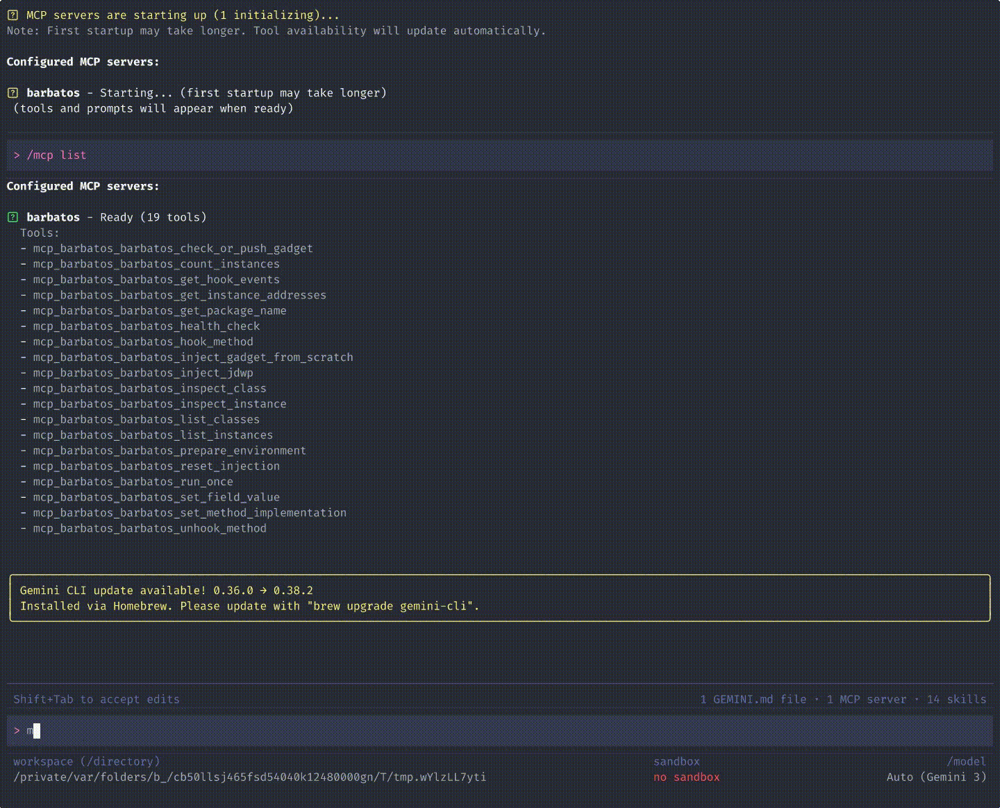
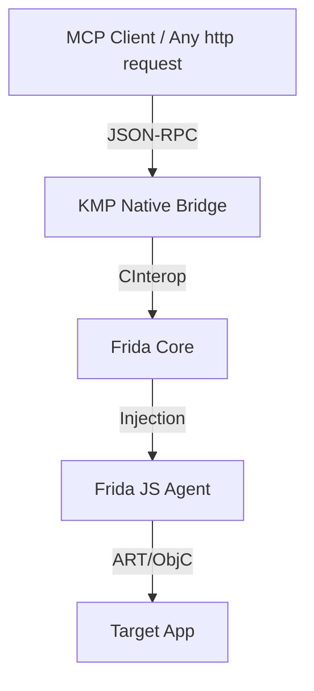

# Barbatos

<p align="center">
  
  
  
  
</p>

<p align="center">
  <b>High-Performance Frida MCP Server for AI Agents & Debuggers.</b><br>
  <i>"Consolidating runtime introspection into a single, native, cross-platform binary."</i>
</p>

<div align="center">
Using Barbatos to explore an app's structure and inspect objects:

</div>

---

## Technical Transformation

Barbatos has evolved from a dual-stack v1 prototype (Kotlin TUI + Python Bridge) into a unified v2 **Kotlin Multiplatform (KMP) Native Bridge**. This transition eliminates the need for Python runtimes, reduces the binary footprint, and significantly improves communication latency.

## Key Features

*   **Unified Native Binary:** Single executable for macOS and Linux. No dependencies, no setup.
*   **JSON-RPC 2.0 API:** Standardized interface over HTTP/Post for consistent integration.
*   **Class Discovery:** Real-time enumeration of loaded Java/Kotlin/ObjC classes.
*   **Deep Inspection:** Recursive traversal of object hierarchies (Fields, Maps, Collections).
*   **Method Hooking:** Intercept execution flow and modify behavior in real-time.
*   **AI-First Design:** Optimized for Model Context Protocol (MCP) and autonomous debugging agents.

---

## Architecture

Barbatos uses a streamlined pipeline for zero-latency runtime interaction:


```mermaid
graph TD
    A[MCP Client / Any http request] -->|JSON-RPC| B[KMP Native Bridge]
    B -->|CInterop| D[Frida Core]
    D -->|Injection| E[Frida JS Agent]
    E -->|ART/ObjC| F[Target App]
```

1.  **KMP Native Bridge**: Compiled via Kotlin Native for deterministic performance.
2.  **Frida Core**: Statically linked C API for process management and instrumentation.
3.  **Frida JS Agent**: Embedded instrumentation code injected directly into the target process.

---

## Quick Start

### Build from Source
```bash
# 1. Setup SDKs
make install_dependencies

# 2. Build for your platform
make release

# 3. Run
make run
```

### API Usage
The bridge exposes a JSON-RPC 2.0 endpoint at `http://127.0.0.1:8080/rpc`.

```bash
# Example: List loaded classes
curl -X POST http://127.0.0.1:8080/rpc \
  -H "Content-Type: application/json" \
  -d '{"jsonrpc": "2.0", "method": "listClasses", "params": {"search_param": "MainActivity"}, "id": 1}'
```

---

## Maintenance & Standards

- **Language:** English only.
- **TDD:** New features must include unit tests in `src/commonTest`.
- **Schema:** All responses must align with `web/openapi.yaml`.

---

## License
MIT License - Copyright (c) 2026 Victor Gazolli.
